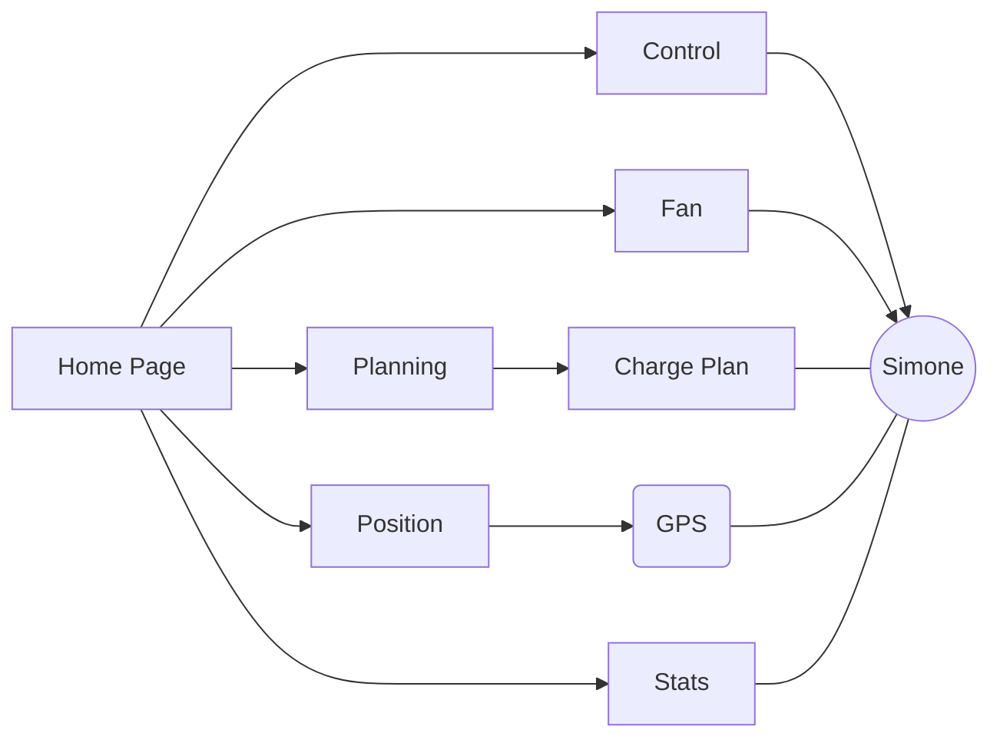

# Wiki - Ergonomie

    

Cette page de Wiki / readme s'inscrit dans le cadre d'un projet Universitaire pour la licence Professionnelle DEVWEB au sein de l'IUT Aix-Marseille.

## Objectif et principe
Notre objectif lors de ce projet est de faire une interface Tesla en se basant sur l'interface existante tout en l'améliorant. Cette interface doit également pouvoir s'adapter à tout type d'écran tout en cherchant une amélioration de la facilité d'utilisation de l'application.

Pour définir rapidement l'ergonomie d'un site Web, cela correspond à la manière dont les éléments de l'interface utilisateur sont conçus pour faciliter l'utilisation du site Web et répondre aux besoins des utilisateurs. Elle implique la conception d'une interface utilisateur efficace, intuitive et agréable à utiliser, afin d'optimiser l'expérience utilisateur et d'améliorer la satisfaction de l'utilisateur.
- La disposition des éléments sur la page
- L'utilisation de couleurs et de polices appropriées 
- L'adaptabilité de la conception à différents appareils et écrans
- La réactivité du site
- L'accessibilité pour les personnes ayant des limitations physiques ou cognitives


## Interface
L'interface a été repensée pour garantir un aspect responsif Ordinateur, Tablette et Mobile le plus simple et facile d'utilisation possible. Ainsi peu importe l'endroit où nous sommes, nous pouvons piloter la voiture facilement et rapidement. 

La page d'accueil se compose donc des éléments essentiels liés à la voiture ainsi qu'une barre de navigation pour accéder aux différents sous-menus et paramétrages de la voiture. 

## Structure de l'interface utilisateur et son style 

Comme dit plus haut les éléments et le style de l'interface reprennent ceux de l'application existante. Nous nous sommes alors d'abord adaptés sur la version téléphone tout en réfléchissant à une solution pour la partie tablette et ordinateur. 
Nous avons également ajouté des animations afin d'y ajouter notre touche personnelle et rendre une expérience utilisateur plus enrichissante et agréable sur notre application.

## Schéma Pages Web

L'architecture global des pages Web suit ce plan :



Cela indique que depuis notre "Home Page", nous avons l'accès vers les autres pages qui composent l'application. 
Du côté, de la page "Position" celle-ci va récupérer les données de la voiture, Simone, pour ensuite communiquer avec les données GPS et affiché sa position de la voiture. 
Pour la page "Planning", nous pourrons créer une prévision de charge et choisir quand débloquer le rechargement de la voiture.

## Langages utilisés 

### PHP / HTML
Pour nous adapter aux autres groupes nous sommes partis sur du PHP, mais nous avons tout de même utilisé d'autres langages. 

### SASS
Un petit frère à CSS bien plus puissant. Il nous permet d'être plus rapide sur le développement grâce à ses fonctionnalités tel que le nesting, 

Puisque le SASS n'est pas lu nativement par les navigateurs, il est nécessaire de le compiler en CSS :
_en suivant l'architecture de nos dossiers, nous avons :_

Se placer dans le dossier `assets`, depuis l'onglet **Shell**
```
cd assets
```
Puis copier la commande pour démarrer la compilation dès lors qu'un changement est détecté : 
```
sass --watch scss:css
```

### Javascript
Pour ajouter les diverses animations (principalement des boutons) ainsi que la gestion possible des boutons, nous avons utilisé le JavaScript.


## Améliorations

Certaines parties de l'application sont encore à revoir. Il nous manque du temps afin de réellement finir ce projet. 

Nous avons tout de même fait le meilleur de nous-même.
